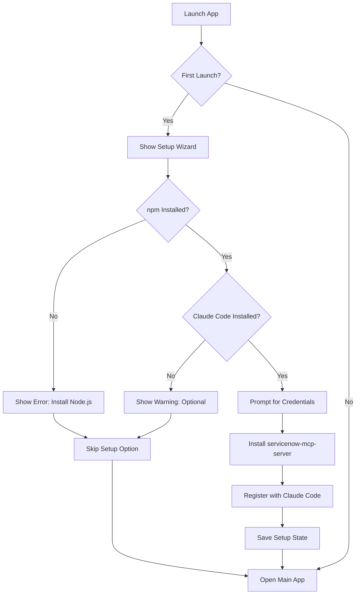

# HappyVibe DMG - Auto-Setup Guide

This guide explains how the HappyVibe desktop app automatically sets up the ServiceNow MCP server when users download and install the DMG.

## 🎯 What Users Get

When users download the **HappyVibe.dmg** and launch the app for the first time:

1. ✅ **Automatic detection** - Checks if npm, Claude Code, and servicenow-mcp-server are installed
2. ✅ **One-click installation** - Installs servicenow-mcp-server via npm
3. ✅ **Auto-registration** - Registers the MCP server with Claude Code
4. ✅ **Credential setup** - Beautiful wizard prompts for ServiceNow credentials
5. ✅ **Skip option** - Users can skip and configure manually later

## 🚀 How It Works

### First Launch Detection

The app creates a `setup_state.json` file in the app data directory:
```
~/Library/Application Support/opcode/setup_state.json
```

On first launch:
- File doesn't exist → Shows setup wizard
- File exists → Skips to main app

### Auto-Setup Flow



### Architecture

**Backend (Rust)**
- `src-tauri/src/auto_setup.rs` - Core auto-setup logic
- Commands:
  - `check_first_launch()`
  - `get_setup_status()`
  - `install_mcp_server()`
  - `register_mcp_server(credentials)`
  - `complete_setup()`
  - `skip_setup()`

**Frontend (React/TypeScript)**
- `src/components/SetupWizard.tsx` - Setup wizard UI
- Beautiful animated wizard with progress indicators
- Error handling and validation
- Skip option for manual setup

## 📦 Building the DMG

### Prerequisites

```bash
# Install Tauri CLI
npm install -g @tauri-apps/cli

# Install Rust (if not already installed)
curl --proto '=https' --tlsv1.2 -sSf https://sh.rustup.rs | sh
```

### Build Process

```bash
# 1. Build the frontend
npm run build

# 2. Build the DMG
npm run tauri build -- --bundles dmg

# 3. Find the DMG
ls src-tauri/target/release/bundle/dmg/
```

The DMG will be at:
```
src-tauri/target/release/bundle/dmg/HappyVibe_0.2.1_aarch64.dmg  # Apple Silicon
src-tauri/target/release/bundle/dmg/HappyVibe_0.2.1_x64.dmg      # Intel
```

### Universal Binary (Both Architectures)

```bash
# Build for both Apple Silicon and Intel
npm run tauri build -- --target universal-apple-darwin --bundles dmg
```

## 🔧 Configuration Files

### Cargo.toml
```toml
[package]
name = "opcode"
version = "0.2.1"
default-run = "opcode"  # Important: Sets desktop binary as default

[[bin]]
name = "opcode"          # Desktop app
path = "src/main.rs"

[[bin]]
name = "opcode-web"      # Web server
path = "src/web_main.rs"
```

### tauri.conf.json
```json
{
  "productName": "HappyVibe",
  "version": "0.2.1",
  "identifier": "com.happyvibe.app",
  "bundle": {
    "active": true,
    "targets": ["dmg"],
    "macOS": {
      "minimumSystemVersion": "10.15",
      "entitlements": "entitlements.plist"
    }
  }
}
```

## 🎨 Setup Wizard Features

### Visual Design
- Gradient background
- Animated transitions
- Progress indicators
- Status icons (✅/⚠️/❌)
- Backdrop blur effects

### User Experience
- Clear error messages
- Installation progress tracking
- Skip option at any point
- Claude Code detection with install instructions
- Credential validation

### Error Handling
- **No npm**: "Please install Node.js first"
- **No Claude Code**: Optional warning with install command
- **Installation fails**: Clear error message with retry option
- **Registration fails**: Credentials validation and retry

## 🔐 Security Considerations

### Credential Storage
Credentials are passed to Claude Code's MCP registration:
```bash
claude mcp add -s user \
  -e "SERVICENOW_INSTANCE_URL=..." \
  -e "SERVICENOW_USERNAME=..." \
  -e "SERVICENOW_PASSWORD=..." \
  servicenow
```

Claude Code stores these in:
```
~/.claude/config/mcp_settings.json
```

### Permissions
The app requests:
- Network access (to verify MCP server)
- File system access (to install npm packages globally)
- Shell access (to run npm and claude commands)

## 📊 Port Configuration

HappyVibe uses distinct ports for clarity:

| Version | Port | URL |
|---------|------|-----|
| **Desktop App** | **1420** | `http://localhost:1420` |
| **Web Version** | **9000** | `http://localhost:9000` |
| **MCP Server** | **3000** | `http://localhost:3000` |

See [PORTS.md](./PORTS.md) for details.

## 🧪 Testing the Auto-Setup

### Test First Launch
```bash
# 1. Build and run the app
npm run tauri dev

# 2. Delete setup state to simulate first launch
rm ~/Library/Application\ Support/opcode/setup_state.json

# 3. Relaunch - should show setup wizard
```

### Test with Different Scenarios

**Scenario 1: Full Setup (Happy Path)**
- npm installed ✅
- Claude Code installed ✅
- Valid credentials entered
- Expected: Successful installation and registration

**Scenario 2: Missing Claude Code**
- npm installed ✅
- Claude Code NOT installed ❌
- Expected: Warning shown, skip option available

**Scenario 3: Missing npm**
- npm NOT installed ❌
- Expected: Error message with Node.js install instructions

**Scenario 4: Invalid Credentials**
- Everything installed ✅
- Invalid credentials entered
- Expected: Registration fails with error message

## 📝 Distribution Checklist

Before distributing the DMG:

- [ ] Test on clean macOS (no Claude Code installed)
- [ ] Test with Claude Code pre-installed
- [ ] Test with invalid credentials
- [ ] Test skip functionality
- [ ] Test on both Apple Silicon and Intel Macs
- [ ] Verify app signature and notarization
- [ ] Test auto-update functionality
- [ ] Verify DMG opens correctly
- [ ] Test drag-to-Applications works
- [ ] Check app icon displays correctly

## 🚢 Release Process

```bash
# 1. Update version in package.json and Cargo.toml
npm version 0.2.2

# 2. Build the DMG
npm run tauri build -- --bundles dmg

# 3. Sign and notarize (macOS)
# Follow Apple's notarization guide

# 4. Upload to GitHub Releases
gh release create v0.2.2 \
  ./src-tauri/target/release/bundle/dmg/*.dmg \
  --title "HappyVibe v0.2.2" \
  --notes "Auto-setup for ServiceNow MCP server"

# 5. Update download link in README
```

## 🎉 User Experience

When a user downloads **HappyVibe.dmg**:

1. **Download** - Get HappyVibe.dmg from GitHub releases
2. **Install** - Drag to Applications folder
3. **Launch** - Double-click HappyVibe
4. **Setup** - Beautiful wizard appears (first launch only)
5. **Enter Credentials** - ServiceNow instance, username, password
6. **Auto-Install** - servicenow-mcp-server installs automatically
7. **Ready!** - MCP server registered with Claude Code
8. **Start Using** - Create Claude sessions with ServiceNow tools!

## 📚 Additional Resources

- [PORTS.md](./PORTS.md) - Port configuration details
- [MCP_SETUP_GUIDE.md](./MCP_SETUP_GUIDE.md) - Manual MCP setup
- [DEPLOYMENT.md](./DEPLOYMENT.md) - General deployment guide
- [Tauri Documentation](https://tauri.app/) - Tauri framework docs

## 🤝 Contributing

To improve the auto-setup:

1. **Backend**: Modify `src-tauri/src/auto_setup.rs`
2. **Frontend**: Modify `src/components/SetupWizard.tsx`
3. **Commands**: Update `src-tauri/src/main.rs` invoke_handler
4. **Test**: Use `npm run tauri dev` to test changes

---

**Questions?** Check the [issues](https://github.com/yourusername/happyvibe/issues) or open a new one!
